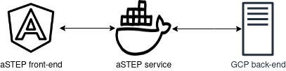

# Time-Series Neural Network Forecasting: Service 
## What is this service?
This service is developed as a part of our Bachelors's project. It is the service responsible for communication between the front-end, and our computation back-end hosted in GCP. Furthermore, the responsibility of this service also entails input validation, designing the GUI of our service, data conversion, etc.

## Technologies
*Here is a list of the important technologies used in this service:*
- Python 3.8.2
- Flask 1.1.2
- Flask-RESTful 0.3.8
- Docker 19.03.9

## How to run
- Download Docker
- Run the start.sh script

*Alternatively:*
- Make sure you have all of the needed Python packages on your system
- Run: *python3 service.py*

You will now have a service running on localhost:5000, which can interface with the aSTEP website.

NOTE: *You need to add a JSON file: private/noGithub/productionData.json*, which contains "uploadURL", "trainURL", "predictURL", "downloadURL", and "registerURL"

### Setup of our service
You can find our Neural Network we run on the computation back-end here: https://github.com/sw6-aau/LSTnet-demo/tree/production 

Please contact us if you need help setting up the backend infrastructure.

## Documentation of GUI
*Please read the documentation file in: public/api/documentation.md*